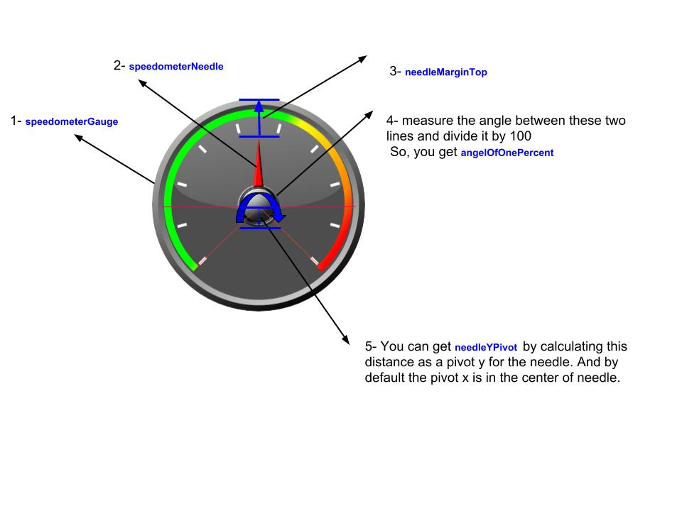

# Speedometer

Custom Speedometer widget.

## Getting Started


### Prerequisites

Android studio project.

### Installing

Using Gradle:

```
dependencies {
   implementation 'org.identitysolutions:speedometer:1.0.1'
}
```

Or Maven:

```
<dependency>
  <groupId>org.identitysolutions</groupId>
  <artifactId>speedometer</artifactId>
  <version>1.0.1</version>
  <type>pom</type>
</dependency>
```

You can check the demo app [Speedometer Sample](https://play.google.com/store/apps/details?id=org.identitysolutions.speedometer.sample)

## How do I use Speedometer?

### Default Example:

```
        <org.identitysolutions.speedometer.SpeedometerView
            android:id="@+id/speedometerView"
            android:layout_width="wrap_content"
            android:layout_height="wrap_content"/>

mSpeedometerView = findViewById(R.id.speedometerView);      
mSpeedometerView.animatePercentage(percentage);

```

### Custom Speedmeter:

```
<org.identitysolutions.speedometer.SpeedometerView
            android:id="@+id/speedometerView"
            android:layout_width="wrap_content"
            android:layout_height="wrap_content"
            app:angelOfOnePercent="2.68"
            app:needleMarginTop="51dp"
            app:needleYPivot="30dp"
            app:speedometerGauge="@drawable/bg_graph"
            app:speedometerNeedle="@drawable/ic_needle" />


mSpeedometerView = findViewById(R.id.speedometerView);      
mSpeedometerView.animatePercentage(percentage);

```

You can calculate these attributes as shown:

## Built With

* [Maven](https://maven.apache.org/) - Dependency Management
* Native Android for speedometer animation

## Versioning

We use [Bintray](https://bintray.com/) for versioning. For the versions available, see the [tags on this repository](https://github.com/MohammedShehata/Speedometer/tags). 

## Authors

* **Mohammed Shehata** - *Initial work*
* **Mohammad El Deeb**

See also the list of [contributors](https://github.com/MohammedShehata/Speedometer/contributors) who participated in this project.

## License

This project is licensed under the [Apache2 License](https://www.apache.org/licenses/LICENSE-2.0)

